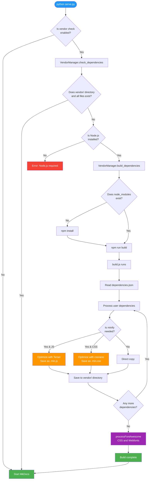

# Phantom Vendor Builder

## :fontawesome-solid-wrench: What Does This Tool Do?

**Phantom Vendor Builder** is a tool that automatically manages JavaScript and CSS dependencies for Phantom Documentation Kit.
It allows you to manage third-party libraries like Chart.js and Font Awesome from a single location.

**Why Is It Necessary?**
Instead of manually downloading each library and copying it to the correct directory, this tool automates the entire process.
You just run the `serve.py` or `build.py` command, and Vendor Builder takes care of the rest.

---

## :fontawesome-solid-diagram-project: Workflow

Vendor Builder works completely automatically. When you run `python serve.py`, here's what happens behind the scenes:

### Detailed Flow Diagram



## :fontawesome-solid-gear: Configuration

### dependencies.json File

All your dependencies are defined in `tools/vendor-builder/dependencies.json`:

```json
{
  "dependencies": [
    {
      "name": "Chart.js",
      "package": "chart.js",
      "from": "node_modules/chart.js/dist/chart.umd.js",
      "to": "chart.umd.js",
      "type": "js",
      "minify": true
    }
  ]
}
```

### Parameter Descriptions

| Parameter | Description                            | Example Value               |
|-----------|----------------------------------------|-----------------------------|
| `name`    | Readable name of the library           | "Chart.js"                  |
| `package` | npm package name                       | "chart.js"                  |
| `from`    | Source file path (inside node_modules) | "node_modules/chart.js/..." |
| `to`      | Target filename (in vendor directory)  | "chart.umd.js"              |
| `type`    | File type                              | "js" or "css"               |
| `minify`  | Apply minification?                    | true or false               |

---

## :fontawesome-solid-folder-tree: Directory Structure

### Vendor Builder Tool Directory Structure
```
tools/vendor-builder/          
├── build.js                    
├── dependencies.json           
├── package.json               
└── node_modules/              
```

### Example Output Directory Structure
```
overrides/assets/vendor/        
├── chart.umd.js               
├── fontawesome-all.min.css    
└── webfonts/                  
    ├── fa-brands-400.ttf
    ├── fa-regular-400.ttf
    └── fa-solid-900.ttf
```

---

## :fontawesome-solid-wrench: Optimization Customization

### Current Optimization Settings

Vendor Builder provides a powerful optimization infrastructure using **Terser** (JavaScript) and **cssnano** (CSS).
These tools are industry standards and produce high-performance outputs.

**Default JavaScript Optimization (Terser):**

- Debugger statements are removed
- Console.log is preserved (for development)
- Safari 10+ compatibility is ensured
- All comments are cleaned

**Default CSS Optimization (cssnano):**

- Unnecessary spaces are removed
- Color values are optimized (#ffffff → #fff)
- Font definitions are merged
- Gradients are simplified

### How to Customize?

To change optimization settings, edit the relevant functions in the `build.js` file:

**For JavaScript (lines 370-384):**
```javascript
async function minifyJavaScript(content, filename) {
  const result = await minify(content, {
    compress: {
      drop_console: false, 
      drop_debugger: true,
      pure_funcs: ['console.log']
    },
    mangle: {
      safari10: true
    },
    format: {
      comments: false
    }
  });
}
```

**For CSS (lines 398-410):**
```javascript
async function minifyCSS(content, filename) {
  const result = await postcss([cssnano({
    preset: ['default', {
      discardComments: { removeAll: true },
      normalizeWhitespace: true,
      colormin: true,
      minifyFontValues: true,
      minifyGradients: true
    }]
  })]).process(content, { from: filename });
}
```

### Optimization Control

Optimization for each dependency is controlled from the `dependencies.json` file:

```json
{
  "name": "Chart.js",
  "minify": true
}
```

- `minify: true` → File is optimized
- `minify: false` → File is copied as-is

**Tip:** Use `minify: false` for already minified files (`.min.js`, `.min.css`) to avoid unnecessary processing.