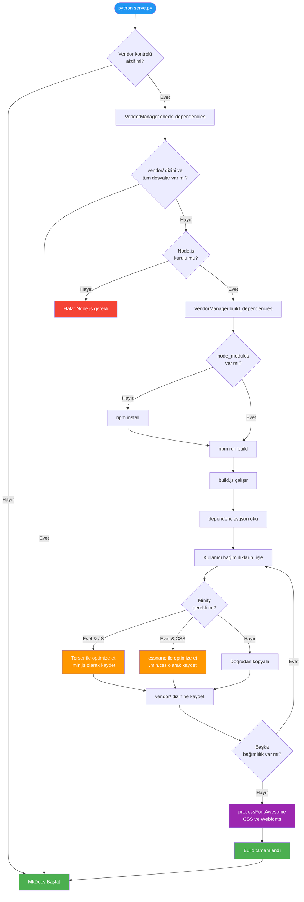

# Phantom Vendor Builder

## :fontawesome-solid-wrench: Bu Araç Ne İşe Yarar?

**Phantom Vendor Builder**, Phantom Documentation Kit'in JavaScript ve CSS bağımlılıklarını otomatik olarak yöneten bir araçtır. 
Dokümantasyon sitenizde kullanılan Chart.js, Font Awesome gibi üçüncü parti kütüphaneleri tek bir yerden yönetmenizi sağlar.

**Neden Gerekli?**
Manuel olarak her kütüphaneyi indirip, doğru dizine kopyalamak yerine, bu araç tüm süreci otomatikleştirir. 
Siz sadece `serve.py` veya `build.py` komutunu çalıştırırsınız, gerisini Vendor Builder halleder.

---

## :fontawesome-solid-diagram-project: Çalışma Akışı

Vendor Builder tamamen otomatik çalışır. Siz `python serve.py` komutunu çalıştırdığınızda arka planda şunlar olur:

### Detaylı Akış Diyagramı



## :fontawesome-solid-gear: Konfigürasyon

### dependencies.json Dosyası

Tüm bağımlılıklarınız `tools/vendor-builder/dependencies.json` dosyasında tanımlanır:

```json
{
  "dependencies": [
    {
      "name": "Chart.js",
      "package": "chart.js",
      "from": "node_modules/chart.js/dist/chart.umd.js",
      "to": "chart.umd.js",
      "type": "js",
      "minify": true
    }
  ]
}
```

### Parametre Açıklamaları

| Parametre | Açıklama                                | Örnek Değer                 |
|-----------|-----------------------------------------|-----------------------------|
| `name`    | Kütüphanenin okunabilir adı             | "Chart.js"                  |
| `package` | npm paket adı                           | "chart.js"                  |
| `from`    | Kaynak dosya yolu (node_modules içinde) | "node_modules/chart.js/..." |
| `to`      | Hedef dosya adı (vendor dizininde)      | "chart.umd.js"              |
| `type`    | Dosya tipi                              | "js" veya "css"             |
| `minify`  | Minifikasyon uygulanacak mı?            | true veya false             |

---

## :fontawesome-solid-folder-tree: Dizin Yapısı

### Vendor Builder Aracı Dizin Yapısı
```
tools/vendor-builder/          
├── build.js                    
├── dependencies.json           
├── package.json               
└── node_modules/              
```

### Örnek Çıktı Dizini Yapısı
```
overrides/assets/vendor/        
├── chart.umd.js               
├── fontawesome-all.min.css    
└── webfonts/                  
    ├── fa-brands-400.ttf
    ├── fa-regular-400.ttf
    └── fa-solid-900.ttf
```

---

## :fontawesome-solid-wrench: Optimizasyon Özelleştirmesi

### Mevcut Optimizasyon Ayarları

Vendor Builder, **Terser** (JavaScript) ve **cssnano** (CSS) kullanarak güçlü bir optimizasyon altyapısı sunar. 
Bu araçlar endüstri standardıdır ve yüksek performanslı çıktılar üretir.

**Varsayılan JavaScript Optimizasyonu (Terser):**

- Debugger ifadeleri kaldırılır
- Console.log'lar korunur (development için)
- Safari 10+ uyumluluğu sağlanır
- Tüm yorumlar temizlenir

**Varsayılan CSS Optimizasyonu (cssnano):**

- Gereksiz boşluklar kaldırılır
- Renk değerleri optimize edilir (#ffffff → #fff)
- Font tanımları birleştirilir
- Gradient'ler sadeleştirilir

### Özelleştirme Nasıl Yapılır?

Optimizasyon ayarlarını değiştirmek için `build.js` dosyasındaki ilgili fonksiyonları düzenleyin:

**JavaScript için (satır 370-384):**
```javascript
async function minifyJavaScript(content, filename) {
  const result = await minify(content, {
    compress: {
      drop_console: false, 
      drop_debugger: true,
      pure_funcs: ['console.log']
    },
    mangle: {
      safari10: true
    },
    format: {
      comments: false
    }
  });
}
```

**CSS için (satır 398-410):**
```javascript
async function minifyCSS(content, filename) {
  const result = await postcss([cssnano({
    preset: ['default', {
      discardComments: { removeAll: true },
      normalizeWhitespace: true,
      colormin: true,
      minifyFontValues: true,
      minifyGradients: true
    }]
  })]).process(content, { from: filename });
}
```

### Optimizasyon Kontrolü

Her bağımlılık için optimizasyon `dependencies.json` dosyasından kontrol edilir:

```json
{
  "name": "Chart.js",
  "minify": true
}
```

- `minify: true` → Dosya optimize edilir
- `minify: false` → Dosya olduğu gibi kopyalanır

**İpucu:** Zaten minified olan dosyalar (`.min.js`, `.min.css`) için `minify: false` kullanın, gereksiz işlem yapmayın.

